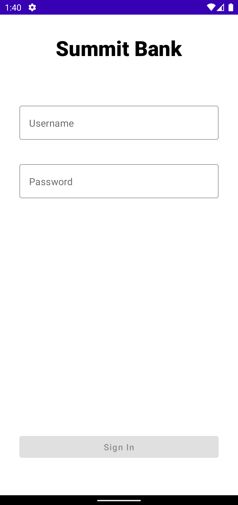
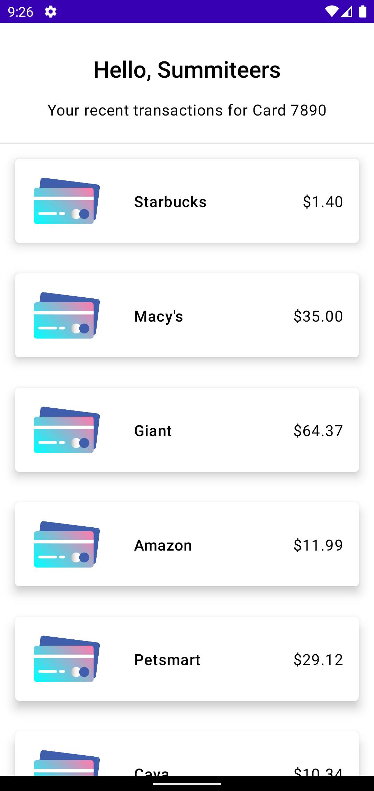

# Software Engineering Summit - Android Workshop
Welcome to the code repo for the Android workshop for Capital One’s Software Engineering Summit!

In this workshop, you will learn a basic Android app featuring a “login” screen which leads to an “account summary” screen which displays the user’s name and the recent transactions for one of their cards.

 

The resulting app will feature the following:
* A single activity app, with 2 fragments representing the 2 screens
* [Jetpack Compose](https://developer.android.com/jetpack/compose), the Android’s modern toolkit for building native UI
* Reactive MVI architecture using [Kotlin flows](https://developer.android.com/kotlin/flow)
* Asynchronous programming using [Kotlin Coroutines](https://www.youtube.com/watch?v=ZTDXo0-SKuU)
* Local data storage for user credentials using [DataStore](https://developer.android.com/topic/libraries/architecture/datastore)
* Fragment to fragment data transfer using [Results API](https://developer.android.com/guide/fragments/communicate#fragment-result)
* Real networking & JSON parsing for login using modern Android libraries

## Getting Started
- Make sure you are in the `Start-here` branch, then open and run the project in Android Studio either on a [physical device or emulator](https://developer.android.com/training/basics/firstapp/running-app).
- You can also switch to the  `Completed`  branch if you’d like to see project after we’re finished.
- Check out `Extra` branch for Data Store implementation.

## Step-by-Step Instructions
See the [Step-by-Step instructions](instructions/step-by-step/README.md) for a full written version of the workshop, including code, screenshots, and helpful links!
