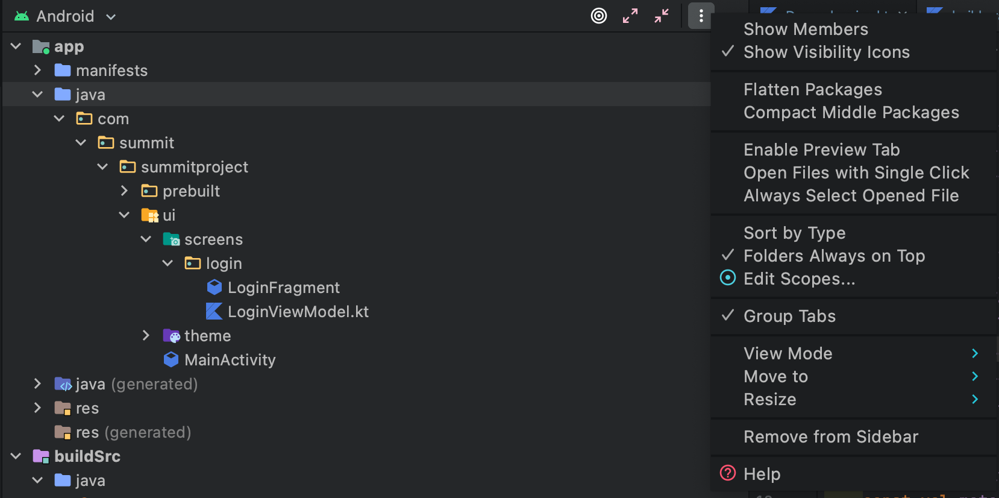

# Setup
This section covers Project Setup (mainly the same as the prereqs) and initial
IDE settings that I like to use for the workshop.

- [Project Setup](#project-setup)
- [IDE Setup](#ide-setup)

## Project Setup
You will need to set up your Android development environment and launch the `Start-Here`

1. Install Android Studio Arctic Fox (Beta Build) from [here](https://developer.android.com/studio/preview).
2. Clone this repository.
3. Open the `Start` project folder in Android Studio.
4. Run the project on a [physical device or emulator](https://developer.android.com/training/basics/firstapp/running-app).

If everything goes right, you should see the following screen when you hit “Run app”!

## Phone/Emulator Setup
Make sure your phone or emulator is not in dark mode when runnin gthis app. We did not adapt the app for a dark theme and using it in dark theme may cause some visual defects.

## IDE Setup (Optional)
If you want the project structure to reflect the same file layout as what I will be using throughout the session, make sure to stay on or switch to `Android` and not `Project`.

I'd also recommend enabling auto-imports, which will automatically add the `import ...`
lines at the top of your code files as you write code.
1. Open the `Preferences` (`Settings` on Windows) -> `Editor -> General -> Auto-Import`
2. Enable `Add unambiguous imports...` and `Optimize imports...`

Finally, make copy this directory layout options to have the same visibility and package structure as we will be referencing throughout the guide.

Note that some images/icons attached to this guide might have different visual apperance than what you may see on your machine. This can be because of Android Studio version difference or presence or lack of certain plugins. With that said, the instruction can be completed with no additional modifications as long as you follow the above set up guide.

[Back to Index](../README.md)
