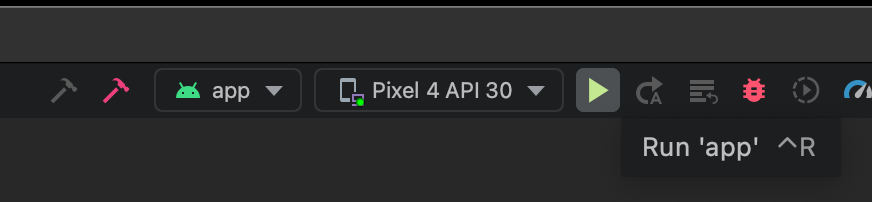
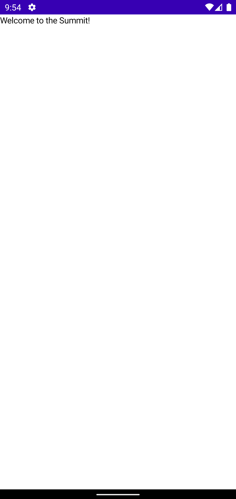
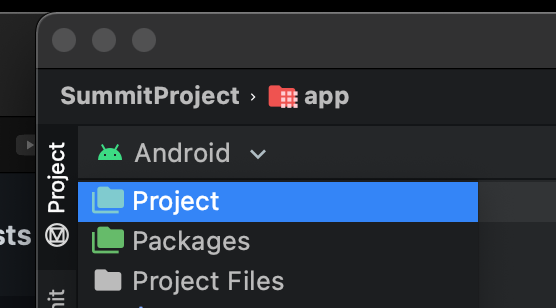

# Setup
This section covers Project Setup (mainly the same as the prereqs) and initial
IDE settings that I like to use for the workshop.

- [Project Setup](#project-setup)
- [IDE Setup](#ide-setup)

## Project Setup
You will need to set up your Android development environment and launch the `Start-Here`

1. Install Android Studio Arctic Fox (Canary Build) from [here](https://developer.android.com/studio/preview).
2. Clone this repository.
3. Open the `Start` project folder in Android Studio.
4. Run the project on a [physical device or emulator](https://developer.android.com/training/basics/firstapp/running-app).

If everything goes right, you should see the following screen when you hit “Run app”!

<!-- {"width":335} -->

## IDE Setup (Optional)
If you want the project structure to reflect the same file layout as what I will be using through    out the session, make sure to stay on or switch to `Android` and not `Project`.

<!-- {"width":278} -->

I'd also recommend enabling auto-imports, which will automatically add the `import ...`
lines at the top of your code files as you write code.
1. Open the `Preferences` (`Settings` on Windows) -> `Editor -> General -> Auto-Import`
2. Enable `Add unambiguous imports...` and `Optimize imports...`

<!-- {"width":354} -->

[Back to Index](../README.md)
