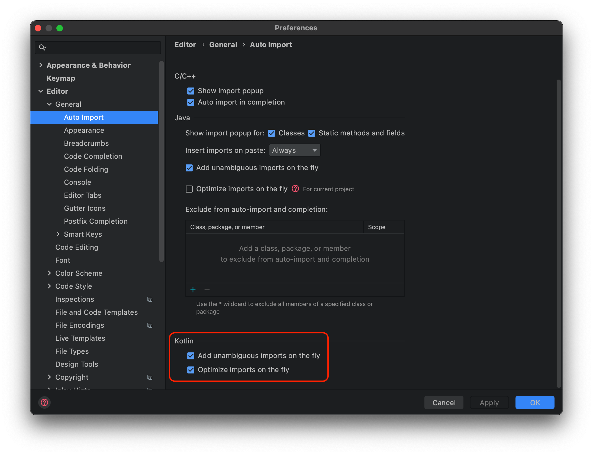

# Setup
This section covers Project Setup (mainly the same as the prereqs) and initial
IDE settings that I like to use for the workshop.

- [Project Setup](#project-setup)
- [IDE Setup](#ide-setup)

## Project Setup
You will need to set up your Android development environment and launch the `Start-Here`

1. Install Android Studio Arctic Fox (Canary Build) from [here](https://developer.android.com/studio/preview).
1. Clone this repository.
1. In Android development environment, switch to the `Start-Here` branch.
1. Run the project on a [physical device or emulator](https://developer.android.com/training/basics/firstapp/running-app).

**Note:** Even if you have previously installed Android Studio, make sure to confirm or install Android Studio Arctic Fox. [Jetpack Compose](https://developer.android.com/jetpack/compose), the toolkit we will be using to develop our UI requires the Arctic Fox build of Android Studio.

If everything goes right, you should see the following screen when you hit “Run app”!

 
 

## IDE Setup (Optional)
If you want the project structure to reflect the same file layout as they are on disk, switch from `Android` to `Project`.

I’d also recommend enabling auto-imports, which will automatically add the `import ...` lines at the top of your code files as you write code.

1. Open the `Preferences` (`Settings` on Windows) -> `Editor -> General -> Auto-Import`
2. Enable `Add unambiguous imports...` and `Optimize imports...`

I'd also recommend enabling auto-imports, which will automatically add the `import ...`
lines at the top of your code files as you write code.
- Open the `Preferences` (`Settings` on Windows) -> `Editor -> General -> Auto-Import`
  - Enable `Add unambiguous imports...` and `Optimize imports...`

[Back to Index](../README.md)
