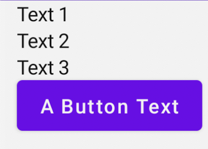
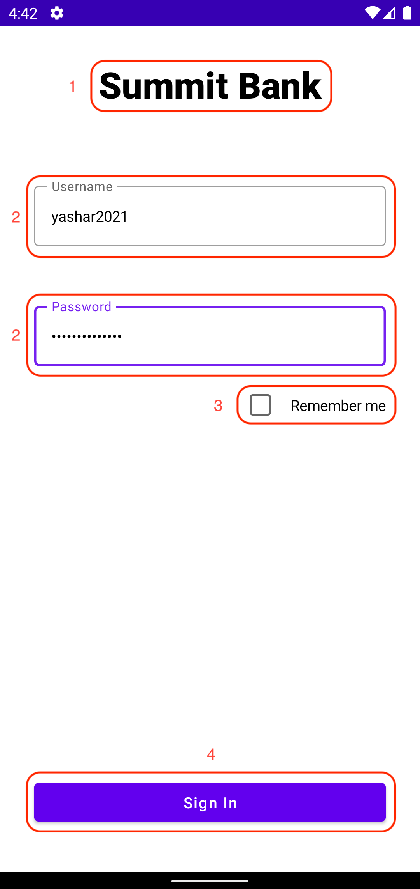
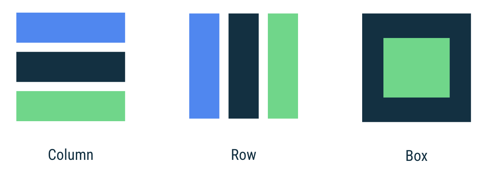
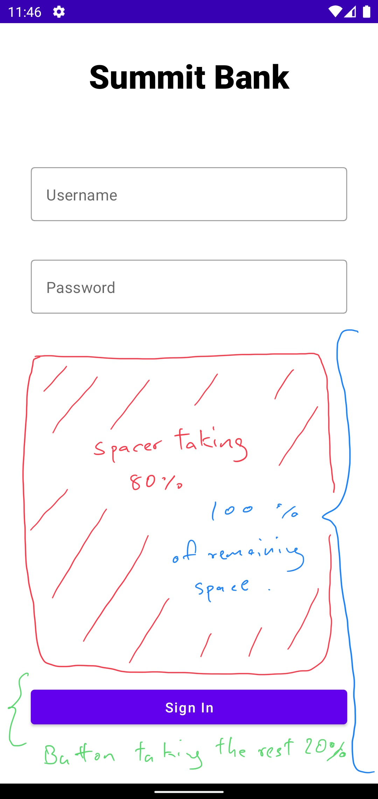

# Login UI
## Login Screen UI
This section covers building the login screen's UI. In Android, UIs were written almost exclusively in XML directly or by using a visual editor. However, the newest and definitely the standard way moving forward is to use Jetpack Compose. Jetpack Compose is a declarative way to write UI codes using Kotlin. Besides being simpler, it has many other advantages you can read about [here](https://developer.android.com/jetpack/compose). Or if you want to dig deeper into the subject, Google also offers [a pathway program](https://developer.android.com/courses/pathways/compose).
## Composable functions
Jetpack Compose makes it much easier to design and build your app's UI. Composable functions are the basic building block of Compose. A composable function is a function that takes some input and generates what's shown on the screen. For more information about composables, take a look at the [Compose mental model documentation](https://developer.android.com/jetpack/compose/mental-model).

To create a composable function, just add the `@Composable` annotation to the function name, like so:
```kotlin
@Composable
fun LoginEditText() { ... }
```

Keep in mind, composable functions can only be called within the scope of other composable functions.

And from within these composable functions, you can use one or more of other custom or default composable UI components to start composing your views. For example, if you wanted to create a row of 3 texts and a button at the bottom, we can do so like this:
```kotlin
@Composable
fun ThreeTextAndOneButton() {
    Column() {
        // Text is also a composable function.
        Text("Text 1")
        Text("Text 2")
        Text("Text 3")
        // So is Button.
        Button(onClick = { }) {
            Text("A Button Text")
        }
    }
}
```

If you were to run the app with above composable as its UI, you'd see something like this:

<!-- {"width":200} -->

Notice how the text and other UI elements are all aligned to the left edge of the screen?
That is the default behavior, and we can change it using something called `modifier`. 

`modifier` lets you decorate or add behavior to Compose UI elements. For example, backgrounds, padding and click event listeners decorate or add behavior to rows, text or buttons.

Let's try and add some left padding to the child views inside `Column` using `modifier`:

```kotlin
@Composable
fun ThreeTextAndOneButton() {
    Column(modifier = Modifier.padding(start = 12.dp)) {
        Text("Text 1")
        Text("Text 2")
        Text("Text 3")
        // So is Button.
        Button(onClick = { }) {
            Text("A Button Text")
        }
    }
}
```




Nice! Now there are some breathing room.

> What is `dp` in `12.dp` here? 

`dp` is a *density-independent pixels* - an abstract unit that is based on the physical density of the screen. These units are relative to a `160 dpi` screen, so one `dp` is one pixel on a `160 dpi` screen. The ratio of dp-to-pixel will change with the screen density, but not necessarily in direct proportion. This is the standard measurement unit for UIs in android development to support multiple devices with different screen sizes.

Similar concept is also applied to font sizes, where a special unit called *scalable pixels* (`sp`) is used. This is like the `dp` unit, but it is also scaled by the user's font size preference. It is recommended that you use this unit when specifying font sizes, so they will be adjusted for both the screen density and user's preference.

I hope you are starting to get a hang of how jetpack compose works! This  a topic that goes deep and wide. So I won't go over every detail here, but as we progress further, we will discover more and more of its awesome features.

### Divide and conquer
Nobody likes duplicated code, as it increases upkeep cost and redundant development time. Luckily, compose is all about making UIs more modular and reusable.

First, let's start by taking a look at what we are trying to create:



We can see that roughly, there are 4 types of UI components we would need to create. Some, we can create just using what comes standard with Jetpack Compose library. Others, we need to create ourselves.

1. Text component to hold our bank's name
2. Text input component to accept user name and password
3. And finally the sign in button itself

For now, let's start by creating what looks the easiest; the text component.

### Text component<!-- {"fold":true} -->


I don't think you are surprised to find that something as essential as text component comes standard with the compose library. And to use it, all we need to do is this:

* Go to `LoginFragment.kt`, and inside `setContent {...}` block, add the following:

```kotlin
/**
*  setContent set the Jetpack Compose UI content for this view.
*/
setContent {
    Text(
        text = "Summit Bank"
    )
}
```

The `setContent` block defines the activity's layout. Instead of defining the layout contents with the traditional `XML` file, we call composable functions. Jetpack Compose library then transform these composable functions into the app's UI elements. Thus overcoming the chicken or the egg problem with composable functions needing to be called within another composable function.

If you run the app now, you will see something like this:


The text is correct, but the design in not quite what we want. Let's think what we are missing…
**Layouts and decorations!**
### Layout<!-- {"fold":true} -->
There are three basic layouts in compose:
* Column: to place items vertically on the screen.
* Row: to place items horizontally on the screen.
* Box:  to put one element on top of another.



### Modifiers<!-- {"fold":true} -->
Modifiers allow you to decorate or augment a composable. Modifiers let you do these sorts of things:

* Change the composable's size, layout, behavior, and appearance
* Add information, like accessibility labels
* Process user input
* Add high-level interactions, like making an element clickable, scrollable, draggable, or zoomable

With this knowledge in mind, let’s get started with updating our UI. We want all of our components to be inside a `Column` since they need to be stacked vertically. Also, we would want to use modifiers to decorate the components.

Now with that in mind, let's try something like this:
```kotlin
/**
 * Set the Jetpack Compose UI content for this view.
 */
setContent {
    /**
     * A layout composable that places its children in a vertical sequence.
     */
    Column(
        horizontalAlignment = Alignment.CenterHorizontally,
        modifier = Modifier.fillMaxWidth()
    ) {
        Text(
            text = "Summit Bank",
            style = MaterialTheme.typography.h4,
            fontWeight = FontWeight.Black,
            modifier = Modifier.padding(vertical = 32.dp)
        )
    }
}
```

We now wrapped the `Text` component inside a `Column` component. We also used modifier and other component parameters to decorate them. Here is what each of them do:

**Column**
* `horizontalAlignment` parameter to define child component alignment. Since we want our views to be centered, we chose `Alignment.CenterHorizontally`.
* `Modifier.fillMaxWidth()` a modifier that tells column to take up the entire width of the screen.

**Text**
* `text` text value we want to show.
* `style` parameter that decides what type of text style we want to use. You can see all the options [here](https://material.io/design/typography/the-type-system.html#type-scale)
* `fontWeight` the weight we want our font to have. We want a very bold look, so we went with `Black` here.
* `Modifier.padding(vertical = 32.dp)` we add `32.dp` of padding to both top and bottom of our Text component so others views we add later won't be touching.

Let's run and see what we made!


Nice! We are off to a good start. Now let's tackle a bit more complicated text input components.
### OutlinedTextField - Username<!-- {"fold":true} -->
Lucky us! This component is also pre-built within the library. Let’s try adding it to our view by appending it to the end of Text component like so:
```kotlin
OutlinedTextField(
    value = "",
    onValueChange = { },
    label = {
        Text(text = "Username")
    }
)
```

If you run the app, you will now see this beautiful outlined text field. However, once you try to interact with it, you will soon find out that it lacks all functionality.


This is because we haven’t passed correct arguments to the `OutlinedTextField`’s parameters. Let’s go over what we need and what they do one by one.

>Quick reminder:
>You can always dig deeper and read the source code of a certain class, interface, value and so on by `cmd` + click for Mac or `ctrl` + click for windows on the specific thing you want to get the details about.
>
>

For us, we are interested in following parameters the `OutlinedTextField` provides:
* `value` the current value of the text field.
* `onValueChanged` the callback that is triggered when the input service updates the text. An updated text comes as a parameter of the callback.
* `label` label to be displayed inside the text field container.
* `singleLine` when set to true, this text field becomes a single horizontally scrolling text field instead of wrapping onto multiple lines.
* `modifier` a Modifier object we covered earlier

Notice how the current state of the text field value is being exposed in `value` but being updated in `onValueChanged`. This requires us to have some variable in-between to hold the text field state so it can be exposed to any view that wants to display its value,  and update its value for changes in that state.

### State in Compose<!-- {"fold":true} -->
The concept of state is at the core of Compose. The reason we saw the text field not update upon key entries was because the `OutlinedTextField` doesn't update itself—it updates when its `value` parameter changes. This is due to how composition and recomposition (UI updates) work in Compose.

>**Key Term:** Composition: when a UI gets drawn on the screen
>
>**Initial composition:** when the UI is drawn for the first time on the screen
**Recomposition:** re-drawing the UI to match the updated state. It's important to note that only the UIs which represent the changed data is recomposed, other UIs are not re-drawing.

### Remember the MutableState<!-- {"fold":true} -->
To update our  `OutlinedTextField` , we need to pass in a value that represents the state of the TextField and add code to update the state when the value of the TextField changes.

To introduce a local state that holds the name that should be displayed, use `remember { mutableStateOf() }`, passing in the default value for the text. That way, whenever the name state changes, the value displayed by TextField will change too.

Composable functions can store a single object in memory by using the `remember` composable. A value computed by remember is stored in the composition during initial composition, and that stored value is returned during recomposition. You can use `remember` to store both mutable and immutable objects.

`mutableStateOf` creates a `MutableState`, which is an `observable` type in Compose. Any changes to its value will schedule recomposition of any composable functions that read that value.

`remember` helps you preserve the state across recompositions. If you use `mutableStateOf` without also using remember, then the state is reinitialized to an empty string every time the `OutlinedTextField` is recomposed.

Let’s try creating a remembered mutable state that our username filed can observe and update:

```kotlin
val usernameFieldValue = remember { mutableStateOf("") }

OutlinedTextField(
    value = usernameFieldValue.value,
    onValueChange = { newUsernameString ->
        usernameFieldValue.value = newUsernameString
    },
    label = {
        Text(text = "Username")
    },
    modifier = Modifier,
    singleLine = true,
)
```

See how we are observing the mutable state in `value = usernameFieldValue.value` and updating the same value when `onValueChange` callback is called with the new string state `onValueChange = { newUsernameString -> usernameFieldValue.value = newUsernameString }`

Ah! It’s responding to our input now!


### OutlinedTextField - Password<!-- {"fold":true} -->
Awesome. Now we know how to create a proper textfield. Now let’s do the entire process all over again with the password textfield… er, on the second thought, let’s not do that.

Repeating same code is not a good practice ([DRY principle](https://dzone.com/articles/software-design-principles-dry-and-kiss)). It is fine here since there are only two text fields, but imagine creating an app that might require 10, 20 or even more. It’s just not scalable, and creates unnecessary point of entry for bugs.

This is were custom composable functions come into play. First, go ahead and create a folder named “components” inside our existing “screens” folder.


In there, create a new kotlin file named `LoginTextField` like so:


In that new file, create a new composable function and copy-paste the username textfield we created earlier:

```kotlin
@Composable // An anotation that denotes this is a composable function
fun LoginTextField() {
    val usernameFieldValue = remember { mutableStateOf("") }

    OutlinedTextField(
        value = usernameFieldValue.value,
        onValueChange = { newUsernameString ->
            usernameFieldValue.value = newUsernameString
        },
        label = {
            Text(text = "Username")
        },
        modifier = Modifier,
        singleLine = true,
    )
}
```

We can now simply call this from our `LoginFragment` like this:

```kotlin
setContent {
    Column(
        horizontalAlignment = Alignment.CenterHorizontally,
        modifier = Modifier.fillMaxWidth()
    ) {
        Text(...)

        LoginTextField() // A one liner!
    }
}
```

Run the app again and confirm that everything still works.

### Re-using the UI state<!-- {"fold":true} -->
When we try and generalize our `LoginTextField` to accommodate both username and password field, we need to consider the following.

When a composable holds its own "hard coded" state like in our `LoginTextField`, it makes the composable hard to reuse. 
For example, take a look at how we are defining the label for the field: `Text(text = "Username")`. With its field defined this way, there is no way to re-use this UI - for a password field for instance. Instead, you should make this a stateless composable—a UI that doesn't hold any "hard coded" state. To do this, we can simply pass in those fields through constructor.

```kotlin
@Composable
fun LoginTextField() {
    val usernameFieldValue = remember { mutableStateOf("") } // <- State

    OutlinedTextField(
        value = usernameFieldValue.value,
        onValueChange = { newUsernameString ->
            usernameFieldValue.value = newUsernameString
        },
        label = {
            Text(text = "Username") // <- State
        },
        modifier = Modifier, // <- State
        singleLine = true, // <- State
    )
}
```

So, to make our `LoginTextField` a state less composable, we need to refactor it to something like below:

```kotlin
@Composable
fun LoginTextField(
    label: String, // <- Hoisted State
    textFieldValue: String, // <- Hoisted State
    onTextFieldValueChange: (String) -> Unit, // <- Event lambda
    modifier: Modifier = Modifier // <- Hoisted State
) {
    OutlinedTextField(
        value = textFieldValue,
        onValueChange = { newUsernameString ->
            onTextFieldValueChange(newUsernameString)
        },
        label = {
            Text(text = label)
        },
        modifier = modifier,
        singleLine = true, // <- State
    )
}
```

To do this, you can use a concept called state hoisting. State hoisting is a programming pattern where you move the state of a composable to the caller of that composable. A simple way to do this is by replacing the state with a parameter and using lambdas to represent events.

Notice the `lambda` `onTextFieldValueChange` that it can call when it wants to request the state change.

State hoisting often means introducing two parameters to the composable:
* `value`: T: the current value to display.
* `onValueChange: (T) -> Unit`: an event that requests the value to change where T is the proposed new value.

`Lambdas` are the most common way to describe events on a composable. It is basically a function stored in a variable. In this example, you define an event called `onTextFieldValueChange` using a `lambda` that takes a `String`, using Kotlin's function type syntax: `(String) -> Unit`. 

The lambda is called `onTextFieldValueChange`—present tense, as **the event doesn't mean the state has already changed**, but rather that the **composable is requesting that the event handler change it**.

Now all we need to do is to pass in the appropriate arguments:

```kotlin
// In LoginFragment.kt
setContent {
    Column(
        horizontalAlignment = Alignment.CenterHorizontally,
        modifier = Modifier.fillMaxWidth()
    ) {
        Text(...)

        val textFieldValue = remember { mutableStateOf("") }

        LoginTextField(
            label = "Username",
            textFieldValue = textFieldValue.value,
            onTextFieldValueChange = { newUsername ->
                textFieldValue.value = newUsername
            },
            modifier = Modifier
        )
    }
}
```

You will soon see this in action when we create password text field.

### Create Password Text Field<!-- {"fold":true} -->
Now we know roughly how the state of a composable function should be handled, let’s apply what we learned by giving the ability to `LoginTextField` to be used both as username field and password field.

Let’s start by taking a look at how we create username field now that most of our states are being passed in by `LoginFragment`.

```kotlin
val textFieldValue = remember { mutableStateOf("") }

LoginTextField(
    label = "Username",
    textFieldValue = textFieldValue.value,
    onTextFieldValueChange = { newUsername ->
     textFieldValue.value = newUsername
    },
    modifier = Modifier
)
```

Wow, looks like we have almost everything we need exposed! All we need to do is create another `LoginTextField` below the current one with states that makes sense for password field:

```kotlin
Column(
    horizontalAlignment = Alignment.CenterHorizontally,
    modifier = Modifier.fillMaxWidth()
) {
    ...

    val usernameTextFieldValue = remember { mutableStateOf("") }

    LoginTextField(
        label = "Username",
        textFieldValue = usernameTextFieldValue.value,
        onTextFieldValueChange = { newUsername ->
            usernameTextFieldValue.value = newUsername
        },
        modifier = Modifier
    )

    val passwordTextFieldValue = remember { mutableStateOf("") }

    LoginTextField(
        label = "Password",
        textFieldValue = passwordTextFieldValue.value,
        onTextFieldValueChange = { newPassword ->
            passwordTextFieldValue.value = newPassword
        },
        modifier = Modifier
    )
}
```

Let’s run the app and see what we got.


Looks almost perfect. There are two issue though.
1. Spacing between text fields are too close.
2. Password entries should be masked.

First problem is easy to fix. Since we expose the modifier, we can pass in desired modifier to decorate the composable the way we want. Let’s add following modifiers to our textfields:

```kotlin
LoginTextField(
    label = "Username",
    ...
    modifier = Modifier
        .padding(
            horizontal = 32.dp,
            vertical = 32.dp
        )
        .fillMaxWidth()
)

LoginTextField(
    label = "Password",
    ...
    modifier = Modifier
        .padding(horizontal = 32.dp)
        .fillMaxWidth()
)
```

It now looks a lot better!


Now to the second problem. How do we mask text for one text field but not other, while having them share a single composable function?

Well, we can make masking of texts a state, and pass in appropriate one for each variant!
Add this new parameter to the `LogintextFieldComponent` and also change the textfield behavior by passing in a new `visualTransformation` argument:

```kotlin
@Composable
fun LoginTextField(
    label: String,
    textFieldValue: String,
    onTextFieldValueChange: (String) -> Unit,
    maskTextInput: Boolean, // <- new!
    modifier: Modifier = Modifier
) {
    OutlinedTextField(
        value = textFieldValue,
        onValueChange = { newUsernameString ->
            onTextFieldValueChange(newUsernameString)
        },
        label = {
            Text(text = label)
        },
        visualTransformation = if (maskTextInput) PasswordVisualTransformation() else VisualTransformation.None, // <- new!
        singleLine = true,
        modifier = modifier,
    )
}
```

> `visualTransformation` transforms the visual representation of the input value For example, you can use `PasswordVisualTransformation` to create a password text field that hides inputted values.

And in `LoginFragment` we can pass in the correct boolean value to either hide or show the field input:

```kotlin
LoginTextField(
    label = "Username",
    ...
    maskTextInput = false, // <- show
    modifier = Modifier
        .padding(
            horizontal = 32.dp,
            vertical = 32.dp
        )
        .fillMaxWidth()
)

LoginTextField(
    label = "Password",
    ...
    maskTextInput = true, // <- hide
    modifier = Modifier
        .padding(horizontal = 32.dp)
        .fillMaxWidth()
)
```

Run and see it works as intended!


Perfect.

### Create Sign In Button<!-- {"fold":true} -->
Buttons, as you may have already guessed, is also a built in composable. With everything we learned so far, applying it like this to the end of our `column` should come with no surprise:

```kotlin
Button(
    onClick = {
        // TODO: add sign in functionality
    },
    modifier = Modifier
        .padding(horizontal = 32.dp)
        .fillMaxWidth()
) {
    Text(
        text = "Sign In",
        style = MaterialTheme.typography.button
    )
}
```

Notice how button requires children composable within it, in this case `Text`, just like how `Column` accepts children composable to stack vertically. This `Text` is then used to create the label for the button.

Here we provided `Text` styled with a `button` typography to match our design. You can learn more about material type system by visiting [google’s material design website](https://material.io/design/typography/the-type-system.html#type-scale).

Run the app and see how it looks now.


Okay, we got a nice looking button. All we need to do now is to give it some breathing room.

This time however, instead of using static padding value, let’s use `Spacer` composable like this: `Spacer(modifier = Modifier.fillMaxHeight(0.8f))`. This composable is basically a blank space that you can put in between two other composable. We can also pass the `spacer`’s height in percentage float value `0% -> 0f and 100% -> 1f` so the space between two composable is always a dynamic yet proportional on any device dimension.

Go ahead and put the spacer above in between the password text field and the sign in button:

```kotlin
LoginTextField(...)

Spacer(modifier = Modifier.fillMaxHeight(0.8f))

Button(...) {
    ...
}
```

Now when you run it, you will the sign in button in more reasonable and ergonomic location.



### Completed Login UI<!-- {"fold":true} -->
Our login screen’s UI is complete! The completed `LoginFragment` code should look as follows:

```kotlin
setContent {
    val passwordTextFieldValue = remember { mutableStateOf("") }
    val usernameTextFieldValue = remember { mutableStateOf("") }

    Column(
        horizontalAlignment = Alignment.CenterHorizontally,
        modifier = Modifier.fillMaxWidth()
    ) {
        Text(
            text = "Summit Bank",
            style = MaterialTheme.typography.h4,
            fontWeight = FontWeight.Black,
            modifier = Modifier.padding(vertical = 32.dp),
        )

        LoginTextField(
            label = "Username",
            textFieldValue = usernameTextFieldValue.value,
            onTextFieldValueChange = { newUsername ->
                usernameTextFieldValue.value = newUsername
            },
            maskTextInput = false,
            modifier = Modifier
                .padding(
                    horizontal = 32.dp,
                    vertical = 32.dp
                )
                .fillMaxWidth()
        )

        LoginTextField(
            label = "Password",
            textFieldValue = passwordTextFieldValue.value,
            onTextFieldValueChange = { newUsername ->
                passwordTextFieldValue.value = newUsername
            },
            maskTextInput = true,
            modifier = Modifier
                .padding(horizontal = 32.dp)
                .fillMaxWidth()
        )

        Spacer(modifier = Modifier.fillMaxHeight(0.8f))

        Button(
            onClick = { /* TODO */ },
            modifier = Modifier
                .padding(horizontal = 32.dp)
                .fillMaxWidth()
        ) {
            Text(
                text = "Sign In",
                style = MaterialTheme.typography.button
            )
        }
    }
}
```
