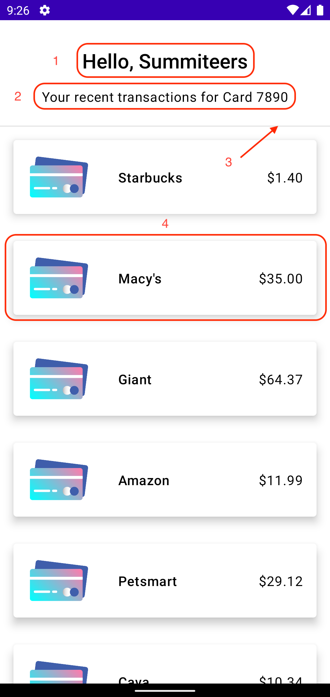
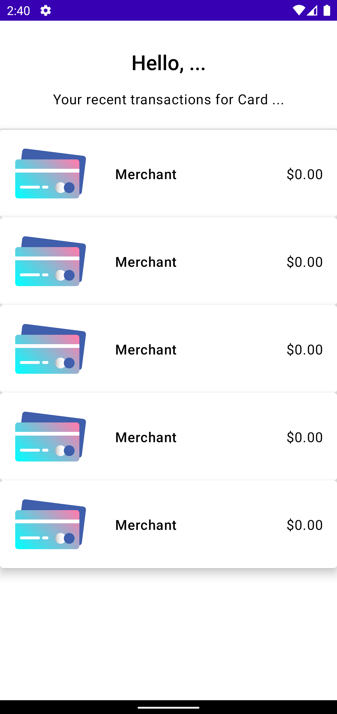
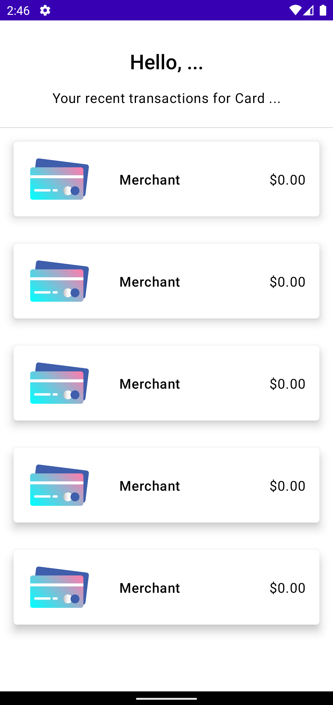

# Summary UI<!-- {"fold":true} -->
## Open SummaryFragment<!-- {"fold":true} -->
Open `SummaryFragment.kt` class within the summary folder.


### Divide and conquer
Let’s see what we want our finished product to look like:



1. A simple text component that we have already created before
2. Same thing, a smaller text component!
3. A divider line component
4. A transaction card component with picture and texts representing that transaction

### Text components
Let’s start by kicking out the simpler text components 1 and 2. Since we know we want all components to be stacked vertically, we will wrap them in a `Column` composable as before:

```kotlin
Column(
    horizontalAlignment = Alignment.CenterHorizontally,
    modifier = Modifier.fillMaxWidth()
) {
    Text(
        text = "Hello, ...",
        style = MaterialTheme.typography.h5,
        fontWeight = FontWeight.SemiBold,
        modifier = Modifier.padding(top = 32.dp)
    )

    Text(
        text = "Your recent transactions for Card ...",
        style = MaterialTheme.typography.body1,
        modifier = Modifier.padding(
            top = 16.dp,
            bottom = 24.dp
        )
    )
}
```

We leave the dynamic portion of our text, the username and the card number, which we will receive from the sign in as `...` for now. We will observe them from the view model as we have done earlier.

### Divider component
This divider is actually a super simple built in composable. We can use it by just dropping `Divider()` at a place where you want the divider to show up. So in our case, right after the second text component:

```kotlin
Text(
    text = "Your recent transactions for Card ...",
    style = MaterialTheme.typography.body1,
    modifier = Modifier.padding(
        top = 16.dp,
        bottom = 24.dp
    )
)

Divider()
```

## TransactionCard component<!-- {"fold":true} -->


Now is the time to make a custom composable function to create the above UI. It might look complicated at the beginning, but if we take a step back and see what exactly they are made from, it will look a lot less daunting.


As you can see above, this is just a combination of few nesting composables that are already included within the Jetpack compose library. All we need to do is to arrange and nest them in the correct order!

Since we want to re-use this composable for each of the transactions, let’s make this it’s own component by creating a new `TransactionCard` composable inside our components folder.


Referring back to our beautiful hand drawn diagram above, we know that the whole thing must be wrapped in a `Card` composable. This comes standard in the library and we can use it like so:

```kotlin
@Composable
fun TransactionCard() {
    Card(
        shape = MaterialTheme.shapes.medium,
        elevation = 8.dp,
        backgroundColor = MaterialTheme.colors.background
    ) {
        
    }
}
```

Now that we have card configured, let’s put in the `Row` that will hold our other composables. We use `verticalAlignment = Alignment.CenterVertically` here to center vertically all of the composable UI inside the row.

```kotlin
@Composable
fun TransactionCard() {
    Card(
        shape = MaterialTheme.shapes.medium,
        elevation = 8.dp,
        backgroundColor = MaterialTheme.colors.background
    ) {
        Row(verticalAlignment = Alignment.CenterVertically) {

        }
    }
}
```

Compose provides a default composable function that loads and modifies an image located inside the project. We already have a pre-imported image `credit_card`, so let’s go ahead and load it using `Image` composable:

```kotlin
Row(verticalAlignment = Alignment.CenterVertically) {
    Image(
        painter = painterResource(id = R.drawable.credit_card),
        contentDescription = "",
        contentScale = ContentScale.Fit,
        modifier = Modifier
            .fillMaxWidth(0.3f)
            .padding(
                vertical = 8.dp,
                horizontal = 16.dp
            )
    )
}
```

`.fillMaxWidth(0.3f)` here works in the same fashion as we saw when we implemented the `Spacer()` composable. It tells the composable to take up 30% of the available space. In this case, 30% of the available width.

Now all that’s left is just two text composable inside another `Row`. This `Row` is used to keep two text composable equidistant from each other while keeping same distance from either edge. For the actual values of the text, we will just put some placeholders for now:

```kotlin
Row(
    horizontalArrangement = Arrangement.SpaceBetween,
    modifier = Modifier
        .fillMaxWidth()
        .padding(horizontal = 16.dp)
) {
    Text(
        text = "Merchant",
        style = MaterialTheme.typography.body1,
        fontWeight = FontWeight.SemiBold
    )
    Text(
        text = "$0.00",
        style = MaterialTheme.typography.body1
    )
}
```

All in all, you should have this right now:
```kotlin
@Composable
fun TransactionCard() {
    Card(
        shape = MaterialTheme.shapes.medium,
        elevation = 8.dp,
        backgroundColor = MaterialTheme.colors.background
    ) {
        Row(verticalAlignment = Alignment.CenterVertically) {
            Image(
                painter = painterResource(id = R.drawable.credit_card),
                contentDescription = "",
                contentScale = ContentScale.Fit,
                modifier = Modifier
                    .fillMaxWidth(0.3f)
                    .padding(
                        vertical = 8.dp,
                        horizontal = 16.dp
                    )
            )

            Row(
                horizontalArrangement = Arrangement.SpaceBetween,
                modifier = Modifier
                    .fillMaxWidth()
                    .padding(horizontal = 16.dp)
            ) {
                Text(
                    text = "Merchant",
                    style = MaterialTheme.typography.body1,
                    fontWeight = FontWeight.SemiBold
                )
                Text(
                    text = "$0.00",
                    style = MaterialTheme.typography.body1
                )
            }
        }
    }
}
```

Now let’s actually see this in action. Go back to the `SummaryFragment` and add the following code after `Divider()`:

```kotlin
repeat(5) {
    TransactionCard()
}
```

This just shows our created component 5 times. Now let’s run the app and see what we have.



Not terrible, but not great. We need to adjust it’s modifiers to give each card some breathing room. Make the `TransactionCard` accept modifier parameter, and apply the said modifier to the `Card` composable. We can then pass in custom modifier from the `SummaryFragment`:

```kotlin
@Composable
fun TransactionCard(
    modifier: Modifier
) {
    Card(
        shape = MaterialTheme.shapes.medium,
        elevation = 8.dp,
        backgroundColor = MaterialTheme.colors.background,
        modifier = modifier
    ) { ...
```

```kotlin
repeat(5) {
    TransactionCard(
        modifier = Modifier
            .height(120.dp)
            .fillMaxWidth()
            .padding(16.dp)
    )
}
```

Now let’s run it.

