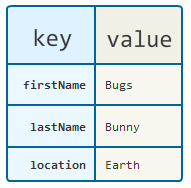

# Extras
## Remember Me Toggle
In this section, we will work on persisting user data on the device using [SharedPreferences API](https://developer.android.com/reference/android/content/SharedPreferences). More specifically, we will be saving the user name if a user chooses to toggle on the “Remember me” check box.


First, we have to start by creating the new checkbox component. The process is exactly the same as when we create other custom UI components. Create a new kotlin file named `CheckBoxWithLabel` inside our components directory:


This is a very simple component that combines `checkbox` and `text` `composables` in a `row`. We also want to be able to pass in its states via its constructor (state hoisting!), so the code to create this will look like this:

```kotlin
/**
 * A reusable UI component that shows a check box followed by a label.
 * @param label a [String] value for the check box.
 * @param onCheck a function that takes [Boolean]. Used to update [LoginState].
 * @param isChecked a [Boolean] of the check box: checked or unchecked.
 * @param modifier a [Modifier] that can be passed in to modify [CheckBoxWithLabel] component.
 */
@Composable
fun CheckBoxWithLabel(
    label: String,
    onCheck: (Boolean) -> Unit,
    isChecked: Boolean,
    modifier: Modifier = Modifier
) {
    Row(
        modifier = modifier.clickable {
            onCheck(!isChecked)
        },
        verticalAlignment = Alignment.CenterVertically
    ) {
        Checkbox(
            checked = isChecked,
            onCheckedChange = { checked ->
                onCheck(checked)
            },
            colors = CheckboxDefaults.colors(checkedColor = MaterialTheme.colors.primary)
        )

        Text(
            text = label,
            modifier = Modifier.padding(start = 16.dp)
        )
    }
}
```

Now that we have the UI ready, lets placed it right below to the right of the password field inside the `LoginFragment` like so:

```kotlin
 LoginEditText(
    label = "Password",
    ...
)

CheckBoxWithLabel(
    label = "Remember me",
    isChecked = false,
    onCheck = { },
    modifier = Modifier
        .padding(
            horizontal = 32.dp,
            vertical = 16.dp
        )
        .fillMaxWidth()
        .wrapContentWidth(Alignment.End),
)
```

Run and see the new UI:


You will notice clicking on it does not actually toggle it on. This is because we are hard coding the checked state to `false` and did not provide any lambda to be called on click (or check).

Let’s do that now.

Since we already have a value that represents the state of the check box, all we really need to do is to create a function that can alter it, and observe the state itself so we can update the UI accordingly.

```kotlin
data class LoginState(
    ...
    val enableSignIn: Boolean = false, // State for checkbox
    ...
)
```

Create a function inside `LoginViewModel` that takes a new boolean and updates the current state of `enableSignIn`:

```kotlin
fun rememberMeChecked(isChecked: Boolean) {
    state.value = currentState.copy(rememberMe = isChecked)
}
```

We can now update our UI in fragment to use this function and observe state being managed by it:

```kotlin
// Add new state reference by others right below the setcontent
val rememberMeChecked: Boolean = viewModel.state.value.rememberMe
```

```kotlin
CheckBoxWithLabel(
    label = "Remember me",
    isChecked = rememberMeChecked, // Not hard coded anymore
    onCheck = { isChecked ->
        viewModel.rememberMeChecked(isChecked) // Pass in the new function
    },
    modifier = Modifier
        .padding(
            horizontal = 32.dp,
            vertical = 16.dp
        )
        .fillMaxWidth()
        .wrapContentWidth(Alignment.End),
)
```

You should now be able to toggle the checker on and off!


## Saving preference
Now that we have a way to determine if a user wants their information saved, let’s create a function that does just that.

### SharedPreference
If you have a relatively small collection of key-values that you'd like to save, you should use the SharedPreferences APIs. A SharedPreferences object points to a file containing key-value pairs and provides simple methods to read and write them.

You can think of key-value pairs as like a table. Each `key` will reference to a single `value`. This way, by saving and reading from a single `key`, we are able to persist and load its value on demand.



In our case, we have 2 simple values that we would want to store and restore. They are:
* username: Username of the user to be stored so it can be auto-filled on next app start
* remember me: The state of the remember me toggle box, so we can maintain the user preference

Now that we know two values we want to store, let’s define `key` for them. Start by creating a new kotlin file named `Constants` in our `login` folder:


In there, we will define 2 `string` `constant`s. `constant` in kotlin is like a `static final` value in Java, meaning that this can only be assigned once, and can not be changed. This is exactly the behavior we want since we don’t want out `key` to change:

```kotlin
/**
 * The key under which the **username**.
 */
const val PREF_USERNAME = "username"

/**
 * The key under which the **remember me**.
 */
const val PREF_REMEMBER_ME = "remember_me"
```

Now that we have both `key` (values we just defined in constants) and `values` (taken from user input, username and whether to remember it or not), let’s create a function to persist this in our `SharedPreferences` database.

We first need to obtain an instance of `SharedPreference`. Go to `LoginFragment` and add this on top of the `onCreateView` block:

```kotlin
override fun onCreateView(
    inflater: LayoutInflater,
    container: ViewGroup?,
    savedInstanceState: Bundle?
): View = ComposeView(requireContext()).apply {
    val sharedPreferences = requireContext().getSharedPreferences("prefs", Context.MODE_PRIVATE)
...
```

This creates an instance of `sharedPreferences` with default settings and an identifier of `"prefs"`. This identifier will come in handy if we need to reference this preference file.

Next, go to `LoginViewModel` and create the following function:

```kotlin
fun savePreference(sharedPreferences: SharedPreferences) {
    val editor = sharedPreferences.edit()
    val usernameToSave = if (currentState.rememberMe) currentState.username else ""

    editor.putString(PREF_USERNAME, usernameToSave)
    editor.putBoolean(PREF_REMEMBER_ME, currentState.rememberMe)
    editor.apply()
}
```

Here, we will be using the instance of `sharedPreferences` we just created and saving username and remember me preference to it. Notice we are only saving the username if the user wants remember me on, otherwise, we replace it with empty string `""`.

`editor` is an object for preferences, through which you can make modifications to the data in the preferences. We use `editor.apply()` to confirm and save our edits.

We can now go back to `LoginFragment` and use this newly created function. We want to save user preference whenever login occurs, so let’s put the function call there and pass in our instance of the `SharedPreference`:

```kotlin
Button(
    onClick = {
        viewModel.savePreference(sharedPreferences = sharedPreferences)
        viewModel.signIn()
    },
    ....
```

We also want to restore data, if any, when the app is launched to ensure the saved username and preference is correctly displayed. 

Go to `LoginViewModel` and add this function:

```kotlin
fun restoreUserCredentials(sharedPreferences: SharedPreferences) {
    if (sharedPreferences.getBoolean(PREF_REMEMBER_ME, false)) {
        state.value = currentState.copy(
            username = sharedPreferences.getString(PREF_USERNAME, "")!!,
            rememberMe = true
        )
    }
}
```

What we are doing here is checking if the user indicated to remember their name during last login. We do that by retrieving the saved `PREF_REMEMBER_ME` key value with `sharedPreferences.getBoolean(PREF_REMEMBER_ME, false)`. If no value exist, we will get `false` by default. If it returns `true`, we then go ahead and restore the saved user data.

Finally, we need to call this function from somewhere. We need the loading of data from `SharedPreference` to occur right after the screen is created, but before its contents are set.

Add following code right after the `SharedPreference` instantiation:

```kotlin
sharedPreferences = ...

viewModel.restoreUserCredentials(sharedPreferences = sharedPreferences)
```

That should be it. Now let’s run the app and confirm everything is working as intended.


Looks great!
## Selecting from a list
Notice in our `LazyColumn` for transaction items, we have `itemsIndexed` function that provides `index`. That `index` corresponds with where the item is located in our list, making our list items aware of their own `index`. 

```kotlin
LazyColumn(modifier = Modifier.fillMaxHeight()) {
    itemsIndexed(items = accountTransactions) { index, transaction ->
        TransactionCard(
            transaction = transaction,
            modifier = Modifier
                .height(120.dp)
                .fillMaxWidth()
                .padding(16.dp)
        )
    }
}
```

This is useful especially when you want to perform certain operations on a specific item in a list. Knowing where exactly they are located within a list allows us to pick out out that item in our `viewModel`.

Let’s see this in action.

First, let’s create a dummy function that represents some sort of “work” being done on a selected item. For example, this can be something like showing a transaction detail page, showing more actions pop up that would allow user to report fraud, and so on. Here, we will just log the selected item to show that each tap indeed selects the correct item.

Go to `SummaryViewModel` and create the following logging function:

```kotlin
fun tapped(transactionIndex: Int) {
    Log.d(
        this::class.java.simpleName,
        "Tapped: ${ currentState.accountTransactions[transactionIndex] }"
    )
}
```

Here we are receiving the `index` of the item, and looking it up in the `accountTransactions` list. Once we find the item, we are then logging the details.

Now all we have to do is call this function and pass in the appropriate `index` like so from the `SummaryFragment`:

```kotlin
LazyColumn(modifier = Modifier.fillMaxHeight()) {
    itemsIndexed(items = accountTransactions) { index, transaction ->
        TransactionCard(
            transaction = transaction,
            modifier = Modifier
                .height(120.dp)
                .fillMaxWidth()
                .padding(16.dp)
                .clickable { viewModel.tapped(index) } // New
        )
    }
}
```

Now run the app and see the log output as you tap each items:


Congratulations! You just made a full fledged app that incorporates many important principles of App development. If you are interested, I recommend you go through codes in `prebuilt` folder to see how they are implemented.

Thanks for reading!
