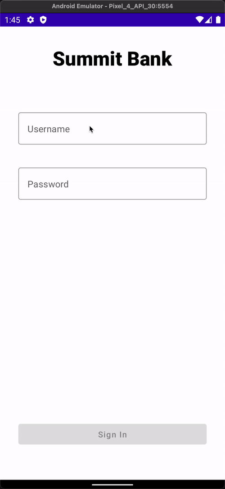

# Shared Preference

## Saving data
If you have a relatively small collection of key-values that you'd like to save, you should use the SharedPreferences APIs. A SharedPreferences object points to a file containing key-value pairs and provides simple methods to read and write them.

You can think of key-value pairs as like a table. Each `key` will reference to a single `value`. This way, by saving and reading from a single `key`, we are able to persist and load its value on demand.


In our case, we have 3 simple values that we would want to store and restore. They are:
* name: Account holder name
* card_last_4: Last 4 digits of the account card
* transactions: Transactions record for this account

Now that we know two values we want to store, let’s define `key` for them. Start by creating a new kotlin file named `Constants` in our `login` folder. We also want to define `key` or a name for our preference file so we can reference it when saving the above three fields. We want these values to be `const val`. `const` in kotlin is like a `static final` value in Java, meaning that this can only be assigned once, and can not be changed. This is exactly the behavior we want since we don’t want out `key` to change:

```kotlin
// Name to used specify our preference file.
const val SHARED_PREFERENCES_NAME = "app_shared_preference"

// The keys under which each field of the [AccountInfo] will be stored in the [SharedPreferences].

const val PREF_NAME = "name"

const val PREF_CARD_LAST_FOUR = "card_last_4"

const val PREF_TRANSACTIONS = "transactions"
```

Now that we have `key` (values we just defined) and `values` (taken from the api call result), let’s create a function to persist this in our `SharedPreferences` database.

We first need to obtain an instance of `SharedPreference`. Go to `LoginFragment` and add this on top of the `onCreateView` block:

```kotlin
override fun onCreateView(
    inflater: LayoutInflater,
    container: ViewGroup?,
    savedInstanceState: Bundle?
): View = ComposeView(requireContext()).apply {
    val sharedPreferences = requireContext().getSharedPreferences(SHARED_PREFERENCES_NAME, Context.MODE_PRIVATE)
    ...
```

This creates an instance of `sharedPreferences` with default settings and an identifier of `"app_shared_preference"` (remember, `SHARED_PREFERENCES_NAME` is defined as `"app_shared_preference"` in our `Constants.kt` file).

Next, go to `LoginViewModel` and create the following function:

```kotlin
fun saveAccountInfo(sharedPreferences: SharedPreferences) {
    val accountInfo = currentState.accountInfo ?: return
    val editor = sharedPreferences.edit()

    editor
        .putString(PREF_NAME, accountInfo.name)
        .putString(PREF_CARD_LAST_FOUR, accountInfo.cardLastFour)
        .putString(PREF_TRANSACTIONS, encodeTransactionsToJson(accountInfo.transactions))
        .apply()
}
```

Here, we will be using the instance of `sharedPreferences` we just created and various account information to it. Few things to note here:
* `val accountInfo = currentState.accountInfo ?: return` all this line does is check if `currentState.accountInfo` is `null` (since it is a nullable value) and escaping from the function early if it is. This is because we can't save null values.
* `encodeTransactionsToJson(accountInfo.transactions)` since we can't store custom object (such as `List<Transaction>`) in `sharedPreferences`, we first convert it to `JSON string` (using a pre-built function) and save it as a string. We will reverse this process to convert it back to our custom object later.

`editor` is an object for preferences, through which you can make modifications to the data in the preferences. We use `editor.apply()` to confirm and save our edits.

We can now go back to `LoginFragment` and use this newly created function. We want to save user preference whenever api result comes through, so let’s put the function call there and pass in our instance of the `SharedPreference`:

```kotlin
/**
* When sign in call succeeds and [AccountInfo] is provided, we transition to the next screen.
*/
if (accountInfo != null) {
    // Since we know accountInfo is recieved, we want to save it now
    viewModel.saveAccountInfo(sharedPreferences = sharedPreferences)
}
```

## Retrieving data
Now, let's head back to `SummaryFragment` and put the `updateAccountInfo` function to use. Update the `onCreate` function in the `fragment` code like so:

```kotlin
override fun onCreate(savedInstanceState: Bundle?) {
    super.onCreate(savedInstanceState)

    // 1
    val sharedPreferences = requireContext().getSharedPreferences(SHARED_PREFERENCES_NAME, Context.MODE_PRIVATE)

    // 2
    val accountHolderName: String = sharedPreferences.getString(PREF_NAME, null) ?: return
    val accountLastFour: String = sharedPreferences.getString(PREF_CARD_LAST_FOUR, null) ?: return
    val transactionsJson: String = sharedPreferences.getString(PREF_TRANSACTIONS, null) ?: return

    // 3
    val accountTransactions: List<Transaction> = decodeJsonToTransactions(transactionsJson)

    // 4
    viewModel.updateAccountInfo(
        accountHolderName = accountHolderName,
        accountLastFour = accountLastFour,
        accountTransactions = accountTransactions
    )
}
```

1. Here we create an instance of `sharedPreferences` with the same `SHARED_PREFERENCES_NAME` so we can access the same preference file.
2. We use the same `var ?: return` to retun early if any field is `null` for any reason.
3. Re-construct `List<Transaction>` from `JSON string` using a pre-built function.
4. Use the retrieving values to update the account information, so the UI shows correct account info.

That is it! Run the app and see the correct info pop up!



## Selecting from a list
Notice in our `LazyColumn` for transaction items, we have `itemsIndexed` function that provides `index`. That `index` corresponds with where the item is located in our list, making our list items aware of their own `index`. 

```kotlin
LazyColumn(modifier = Modifier.fillMaxHeight()) {
    itemsIndexed(items = accountTransactions) { index, transaction ->
        TransactionCard(
            transaction = transaction,
            modifier = Modifier
                .height(120.dp)
                .fillMaxWidth()
                .padding(16.dp)
        )
    }
}
```

This is useful especially when you want to perform certain operations on a specific item in a list. Knowing where exactly they are located within a list allows us to pick out out that item in our `viewModel`.

Let’s see this in action.

First, let’s create a dummy function that represents some sort of “work” being done on a selected item. For example, this can be something like showing a transaction detail page, showing more actions pop up that would allow user to report fraud, and so on. Here, we will just log the selected item to show that each tap indeed selects the correct item.

Go to `SummaryViewModel` and create the following logging function:

```kotlin
fun tapped(transactionIndex: Int) {
    Log.d(
        this::class.java.simpleName,
        "Tapped: ${ currentState.accountTransactions[transactionIndex] }"
    )
}
```

Here we are receiving the `index` of the item, and looking it up in the `accountTransactions` list. Once we find the item, we are then logging the details.

Now all we have to do is call this function and pass in the appropriate `index` like so from the `SummaryFragment`:

```kotlin
LazyColumn(modifier = Modifier.fillMaxHeight()) {
    itemsIndexed(items = accountTransactions) { index, transaction ->
        TransactionCard(
            transaction = transaction,
            modifier = Modifier
                .height(120.dp)
                .fillMaxWidth()
                .padding(16.dp)
                .clickable { viewModel.tapped(index) } // New
        )
    }
}
```

Now run the app and see the log output as you tap each items:


Congratulations! You just made a full fledged app that incorporates many important principles of App development. If you are interested, I recommend you go through codes in `prebuilt` folder to see how they are implemented.

Thanks for reading!